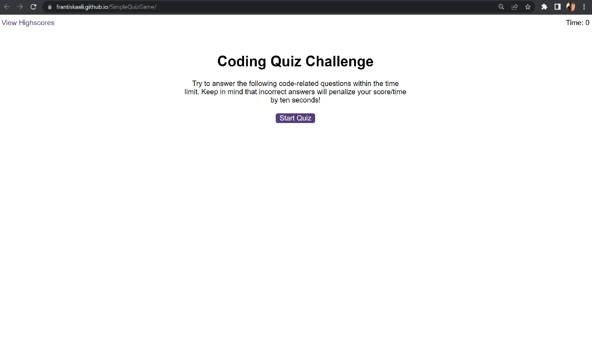
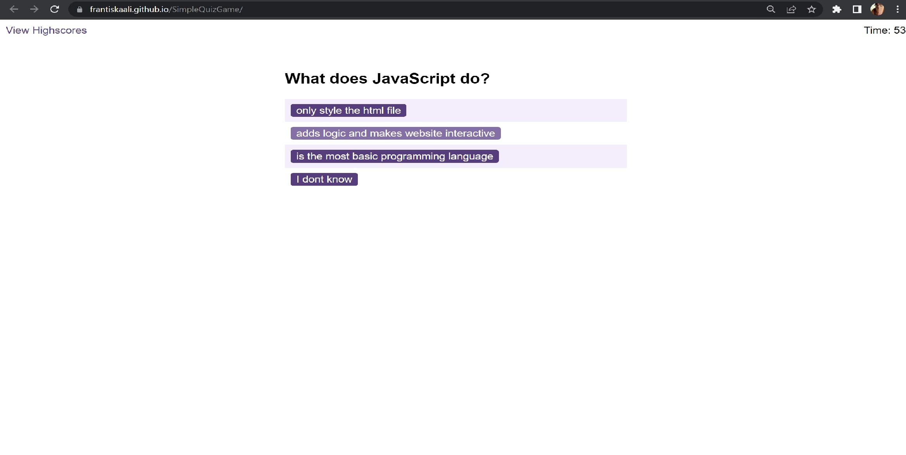
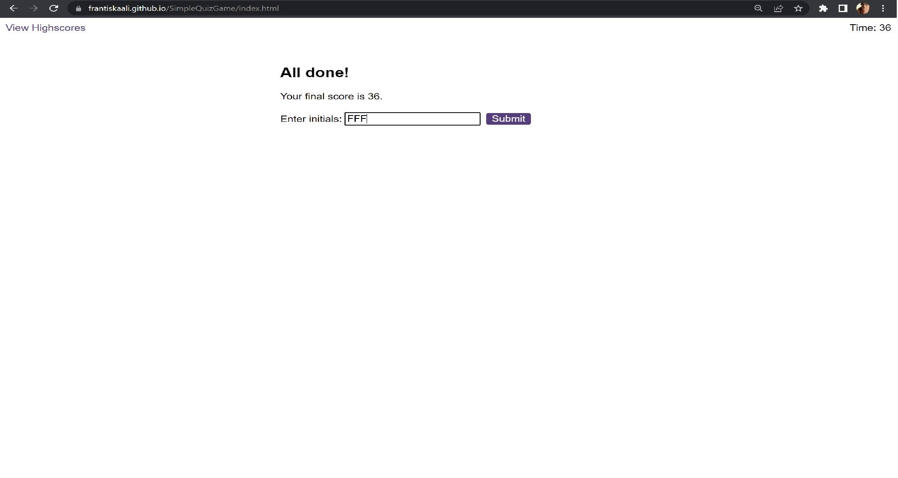
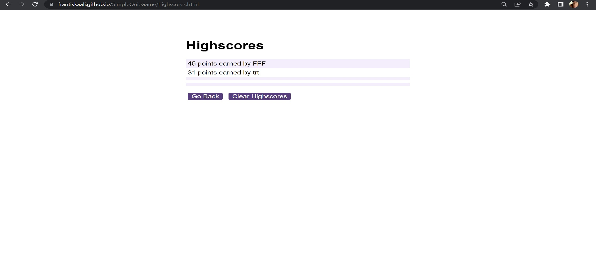

# SimpleQuizGame
QuizGame challenge for Bootcamp 

## Description
This simple quiz game was created as a fun way to check some ofnewly gained JS knowladge.
It is aninteractive JavaScript app that uses web apis.
### What have I learned
while working on this  challange I :
- practised basic JavaScript knowladge and logic.
- created HTML elements by JavaScript
- learned how to link multiple HTML sites in one project.
- increased my knowladge of how web applications work. 
- learned how to use local storage of a  browser.

## Usage
To play this quiz game just press start button timer will start countdown and question with list of answers will appear. For every wrong answer 10 seconds will be substracted from the timer.
If you run out of time, you will be redirected to the begining. If you finish the time you have left will be counted as your final score.
Save your score and see if you made a leaderboard !!
## Screenshots
This is how my application looks
- First page:

- Questions asked: 

- End of the game screen:

- Highscores site 

## Link
[HERE](https://frantiskaali.github.io/SimpleQuizGame/) you can find my final deployed application, enjoy the game !!! :o)